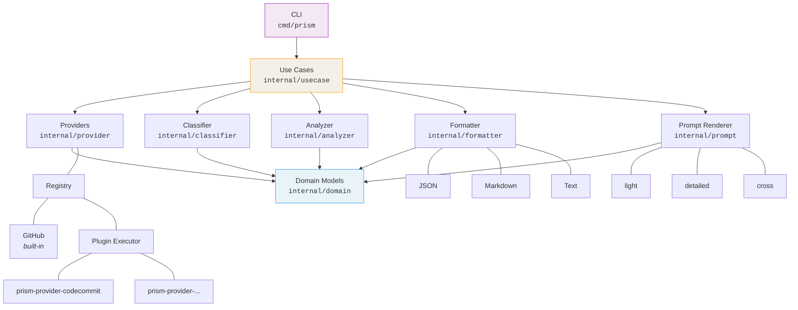
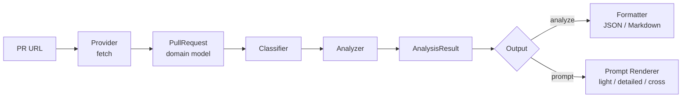

# Architecture

## Overview

prism follows a layered architecture with clear separation between external data sources (providers), domain logic, and output formatting.



### Data Flow



## Package Responsibilities

### `pkg/prism`

Public API for embedding prism as a library. The only exported package outside of `cmd/`.

Exposes `Analyze` and `Prompt` functions, stable input/output types (`AnalyzeOptions`, `Result`, `PRInfo`, `AnalysisResult`, `ChangedFile`), and sentinel errors (`ErrInvalidInput`, `ErrUnsupportedProvider`, `ErrAuthRequired`, `ErrUpstreamFailure`) for client-side branching.

Consumers:

- **cmd/prism** — the CLI (refactor to use pkg/prism is Phase 2)
- **prism-api** — HTTP service (planned)
- **Editor / IDE plugins** — library consumers
- **CI / automation tools** — library consumers

See [ADR-0002](adr/0002-public-api-boundary.md) for the design rationale and compatibility policy.

### `cmd/prism`

CLI entrypoint. Parses arguments, resolves configuration, and delegates to use cases. Should remain thin.

### `internal/domain`

Core domain models shared across the entire application. No external dependencies.

- `PullRequest` — PR metadata, changed files, diff summary
- `ChangedFile` — per-file change details (path, status, additions, deletions, patch, language flags)
- `AnalysisResult` — classification output (change type, risk, review axes, warnings)
- `PromptBundle` — assembled prompt (mode, system prompt, user prompt, attached context)
- `PRRef` — provider-agnostic PR reference (provider, owner, repo, PR number)

### `internal/provider`

Adapters for external PR sources. Each provider implements the `Provider` interface:

```go
type Provider interface {
    Parse(input string) (PRRef, error)
    FetchPullRequest(ctx context.Context, ref PRRef) (PullRequest, error)
}
```

All provider-specific data is normalized into domain models at the provider boundary.

The provider layer consists of:

- **Registry** — resolves a provider by name or auto-detects from URL. GitHub is built-in; other providers are discovered as external plugin binaries (`prism-provider-<name>`) on PATH.
- **Plugin Executor** — runs an external provider binary as a subprocess, parses its stdout JSON into domain models, and enriches files with language/test/config classification.
- **Plugin Protocol** — plugins are invoked as `prism-provider-<name> fetch <PR_URL>` and return a JSON object to stdout. See [ADR-0001](adr/0001-provider-plugin-architecture.md) for details.

### `internal/classifier`

Determines change type based on PR title, description, file paths, and diff content.

Output categories: `feature`, `bugfix`, `refactor`, `test-only`, `docs-only`, `config-change`, `dependency-update`, `infra-change`.

### `internal/analyzer`

Estimates risk level and suggests review axes based on classification results and file characteristics.

### `internal/formatter`

Serializes `AnalysisResult` into output formats (JSON, Markdown, text).

### `internal/prompt`

Renders `PromptBundle` for each review mode using templates.

### `internal/usecase`

Orchestrates the pipeline: fetch → classify → analyze → format/render. Each use case corresponds to a CLI command.

## Design Principles

1. **Provider abstraction first** — New PR sources are added as external plugin binaries without modifying prism itself
2. **Domain models are the contract** — All packages communicate through domain types
3. **Output stability** — JSON schema must remain backward-compatible within a major version
4. **Testability** — All external dependencies are behind interfaces; use fixtures and golden files for output verification
5. **No LLM dependency** — prism compiles context, it does not invoke AI
